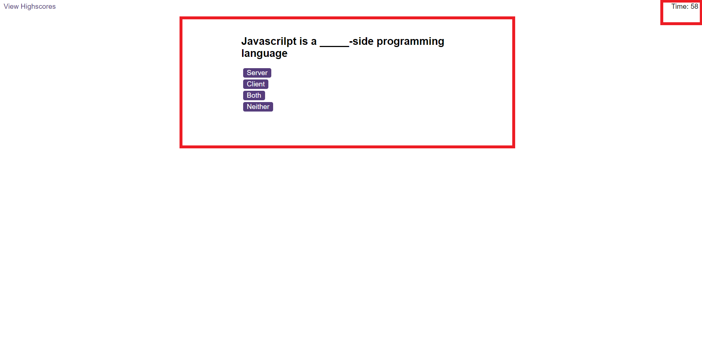
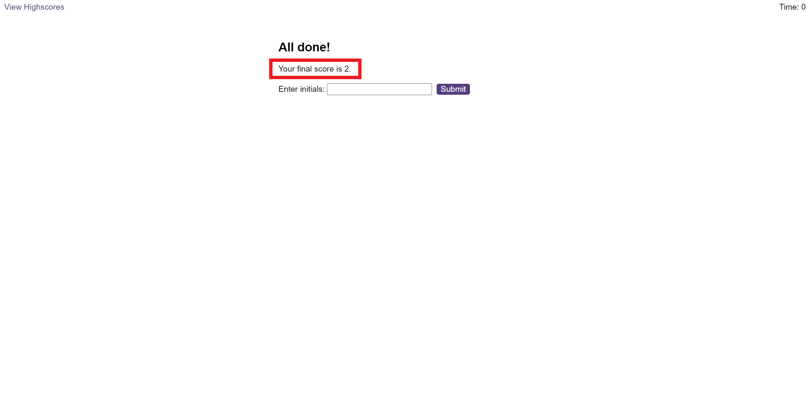

# Javascript-quiz-

## Description

This is a quiz on Javascript using Javascript code. 

## Usage

The original page will look as below.

When the user presses the "Start Quiz" button, the quiz will start, along with a countdown timer. 

Incorrect answers will reduce the timer by 5 seconds.

Once the quiz is finished an endpage will appear which will state the user's scoreand allow them to input their initials.

Clicking the Submit screen will take the user to a highscores page.

Deployed page: https://moobell1212.github.io/Javascript-quiz-/

# License

MIT

